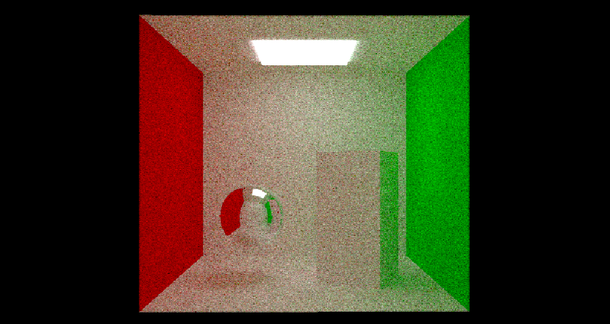
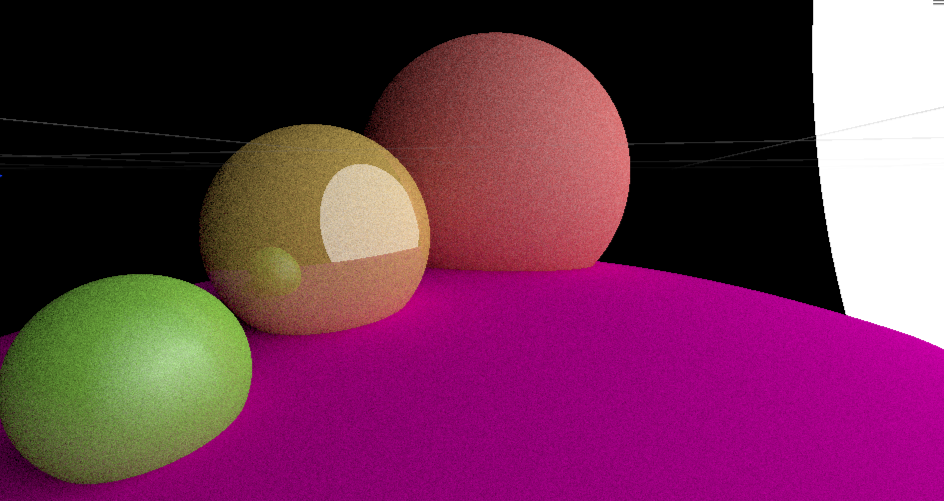

# Path Tracer

## Overview
A simple path tracing engine developed in Unity using HLSL.

## Features
- Basic path tracing for realistic lighting and shadows.
- Implemented using Unity's built-in render pipeline and HLSL shaders. 

## Samples
### Scene 1

